# 相机标定零基础入门教程

> 给完全没接触过的人写的。不需要数学背景，不需要会编程，甚至不需要知道相机是怎么工作的。

---

## 第一部分：为什么要标定？

### 1.1 眼睛怎么看世界

你坐在房间里看书。眼睛看到文字、杯子、窗外的树。一切都很自然，你从来没"想"过怎么看。

但你大脑在后台干了件特别复杂的事：接收两只眼睛传来的平面画面，自动算出每个东西在空间里的位置、大小、距离。全程无感，就像呼吸一样。

相机做不到这个。它只能把三维世界压扁成一张二维照片。一只立体的苹果变成了圆形的苹果贴纸，你没法从贴纸上看出苹果有多厚。

### 1.2 一张照片丢了什么

拍一张棋盘格照片的时候，发生了这三件事：

1. 深度信息没了。你分不清棋盘格离相机是一米还是十米。一米远的小棋盘和十米远的大棋盘，在照片上可能一模一样大。
2. 尺度信息没了。照片上一个像素对应现实世界多少厘米？没人知道。
3. 直线可能被拍弯了。照片边缘的棋盘格边缘会微微弯曲。

就像透过一块不平整的玻璃看外面的电线杆。它们可能是弯的，你也不知道哪根近、哪根远。相机标定，就是给这块玻璃做体检。

### 1.3 标定到底在干什么

两个问题：

- "相机自己的眼睛长什么样？"——**内参**。焦距有多长、感光芯片在哪儿，这些是你没法改变的东西。
- "相机现在站在哪里、看向何方？"——**外参**。每移动一次相机，这个答案就变一次。

知道这些参数后，就能把三维点投影到图像上，也能把一个像素反算成相机前方的一条空间射线。仅凭单张照片中的一个像素，仍然不能唯一确定物体的三维位置；还需要已知平面、深度信息或另一台相机等额外条件。

### 1.4 这跟我有什么关系

你可能觉得标定是实验室里的东西。其实你天天在用：

手机人像模式拍出背景虚化的照片，首先得知道每个像素离相机多远。不标定，算不出这个距离。

自动驾驶的车载摄像头要判断前车位置。很小的角度误差传到远处，也会形成明显的位置偏差。

AR游戏里皮卡丘站在草地上，需要手机精确知道自己相对于地面的位置。

工厂里机械臂用相机找零件。标定不准，抓空是小事，撞到东西是大事。

无人机拍一堆照片自动生成建筑物3D模型，每张照片拍摄时相机的位置都得精确知道。

这些应用通常都需要可靠的相机标定，否则后续的测量和定位会带着系统误差。

---

## 第二部分：相机是怎么成像的？

### 2.1 最简单的相机

你小时候可能玩过：找个纸盒，一面扎针尖大的孔，对面贴白纸。黑暗的盒子里，白纸上出现外面景物的倒立影像。这就是小孔成像。

为什么一个针孔能成像？

- 树顶反射的光穿过小孔，落在白纸下方
- 树根反射的光穿过小孔，落在白纸上方
- 结果：白纸上出现一棵倒立的树

针孔是个严格的"交通管制员"，只允许每条光线从特定方向进来。所有普通相机，在最理想的模型下，都可以简化成这么个东西。

那为什么现代相机不用小孔而用透镜？针孔的致命问题是进光量太小——倒不是光"变慢了"，而是**入口实在太窄，单位时间能挤进来的光少得可怜**，导致收集够亮一张照片所需的总光量要等很久。理想针孔直径只有零点几毫米，进光面积大约是普通镜头的万分之一。大晴天用针孔也得曝光好几分钟。透镜把入口做大到几十毫米，同样场景不到千分之一秒就收集完了。代价是引入了各种光学不完美——就是我们后面要讲的畸变。

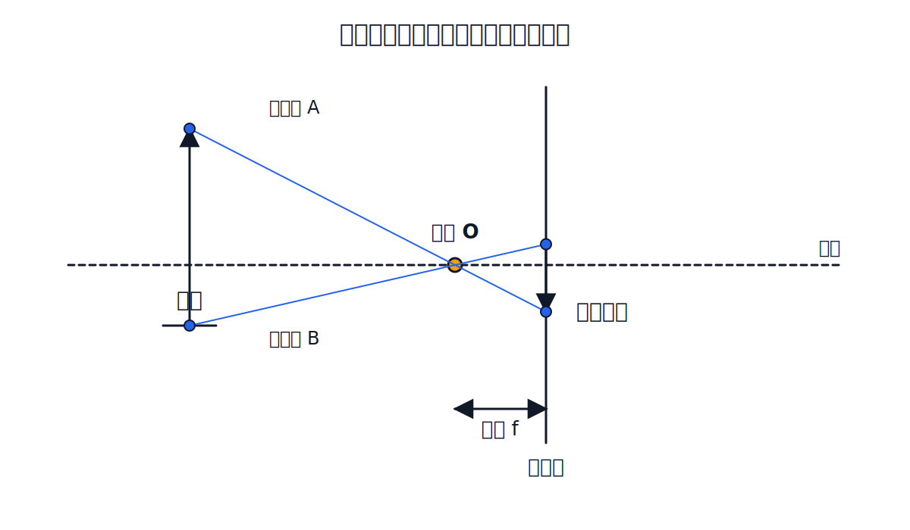

*图 1：物点发出的代表光线经过光心，在像平面形成上下倒置的影像。*

### 2.2 从三维世界到二维照片

拍照这件事，经历了四次"换乘"。用给房间拍照来串这个故事。

**第一站：世界坐标系**

空旷大厅中央放了把椅子。你需要一个参照物来描述椅子的位置——"以大厅西南角地面为原点，向东3米、向北2米、高0.5米"。大厅就是世界坐标系。

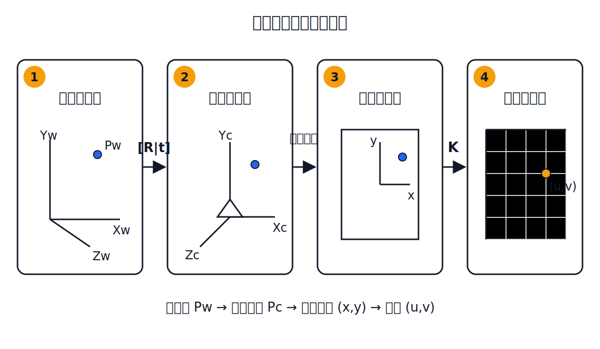

*图 2：一个三维点依次经过外参变换、透视投影和内参变换，最终成为图像中的像素。*

坐标系是什么？三把互相垂直的尺子（X轴指向东、Y轴指向北、Z轴指向天）从一个起点出发，构成三维网格。任何物体的位置用三个数就能定位——向东几米、向北几米、向上几米。起点选哪里都行。墙角、椅子腿、地板上贴条胶带，看哪个方便用哪个。

**第二站：相机坐标系**

你走到大厅某个位置，举起相机。对相机来说，它以自己为宇宙中心重新定义了三维尺子：原点在镜头中心，Z轴是看出去的方向，X轴水平向右，Y轴垂直向下。

世界坐标系和相机坐标系之间的关系，就是前面说的外参。它包含旋转和平移，用来把世界坐标转换到相机坐标。

你在陌生城市打开手机地图。世界坐标系是经纬度，相机坐标系是你手机GPS上那个蓝点。导航本质上就是在不断更新你和世界之间的外参。

**第三站：图像坐标系**

光线穿过镜头，落到相机内部的感光芯片上。芯片上的点可以用二维物理坐标描述，单位通常是毫米。为便于讲解，这里把原点选在芯片中心；不同教材也可能选主点作为原点。

三维到二维怎么变的？一个几何关系：物体离相机越远，在芯片上的像越小，而且是按比例缩小。像高 = 物体真实高度 × (焦距 ÷ 距离)。括号里的部分就是"缩放比例"——焦距越长、距离越近，比例越大，像越大。

**第四站：像素坐标系**

感光芯片上的物理坐标还要转换成照片上的像素坐标。两个因素决定：每个像素的物理尺寸（一个像素在芯片上占多少毫米），以及芯片中心在照片上对应的像素位置（理想情况下是照片正中央，但工艺误差会有微小偏移）。

经过四次换乘，三维世界的一个点走到了照片上的一个像素。把整个过程压缩成一句话：**外参负责"把世界搬到相机眼前"，内参负责"把眼前的东西变成照片"。** 标定做的事，就是从一堆照片反向推出这两组参数。

**一张表总结四个坐标系：**

| 坐标系     | 描述                   | 单位    | 类比               |
| ---------- | ---------------------- | ------- | ------------------ |
| 世界坐标系 | 物体在真实世界中的位置 | 米/厘米 | 地图上的经纬度     |
| 相机坐标系 | 以相机为中心看物体     | 米/厘米 | 手机GPS蓝点        |
| 图像坐标系 | 物体在感光芯片上的位置 | 毫米    | 底片上的位置       |
| 像素坐标系 | 物体在数字照片上的位置 | 像素    | 屏幕上第几行第几列 |

> **实操提示：** 标定的时候，世界坐标系就是你随手贴在棋盘格上的。棋盘格左上角当原点，X 轴沿右边走，Y 轴沿下边走，Z 轴垂直板面向外。角点坐标就是 (0,0,0)、(2.5cm,0,0)、(5cm,0,0)……跟房间、地面都没有关系。外参算的也是"这块板子相对于相机"的位姿，不是"相机在地球上的 GPS 坐标"。所以对单目标定来说，**"世界坐标系"本质上就是"棋盘格坐标系"**，你说了算。

**一个具体例子：**

房间里有盏吊灯，灯罩中心在世界坐标(1.2米, 2.5米, 1.8米)。你站在房间另一端，相机在距墙角(4米, 1米, 1.5米)处，朝向吊灯方向。

外参先做一步——吊灯在相机坐标系中的位置变成了(2.1米, -0.3米, 3.5米)。数字变了，因为参考系从房间墙角换成了相机镜头。

内参接着把这个3D坐标映射到感光芯片——根据焦距等参数，吊灯落在芯片上的物理位置是(1.23mm, -0.18mm)。

最后换算成像素，例如落在第1120行、第845列附近。

这里有一个关键认知：**照片上的一个像素，对应的是真实世界中的一整条线，不是一个点。** 从相机镜头出发，沿着"第1120行、第845列"这条光线一路射出去，光线上的任何物体——不管是 2 米外的小吊灯，还是 20 米外的大灯笼——只要它们恰好在这条光线上，打到感光芯片上都是同一个像素。一张照片拍不出远近。

这就好比抬头看夜空：你能指着一颗星星说"它在那个方向"，但仅凭肉眼你没法判断它是近处的行星还是几百光年外的恒星。它们都在同一条视线上。

所以标定后你可以从像素反算出这条光线的方向，但要确定吊灯具体在光线上哪个位置（离相机多远），单张照片不够，需要额外的信息——比如另一台相机同时拍（双目）、或者你知道吊灯的物理大小（场景约束）、或者你前后移动相机拍多张。这就是第六、第七部分要讲的内容。

### 2.3 内参和外参到底是什么

**内参**就是相机自己的体质。

有人近视，有人散光，有人瞳孔大。相机也一样。每台相机天生有一些自己的属性：

- 焦距f：镜头中心到感光芯片的距离，单位毫米。它决定了"放大倍率"——f 越长，远处物体在芯片上的像越大。
- 主点(cx, cy)：光轴与成像平面的交点在照片上的像素坐标。理想情况下接近照片中心，但通常有少量偏移。
- fx、fy：以像素为单位表示的焦距。物理焦距 f 用毫米表示，而照片上的位置用像素表示，所以需要除以单个像素的物理尺寸：

  `fx = f ÷ 像素宽度``fy = f ÷ 像素高度`

  例如，焦距为 5mm，单个像素宽 0.002mm，那么 `fx = 5 ÷ 0.002 = 2500` 像素。这里的 2500 并不是说镜头里排了 2500 个像素，而是说：在水平方向做投影计算时，5mm 的焦距相当于 2500 个像素。

  对于相机坐标系中的三维点 `(X, Y, Z)`，它在照片中的位置为：

  `u = fx × X ÷ Z + cx``v = fy × Y ÷ Z + cy`

  `fx` 负责水平方向，`fy` 负责垂直方向。例如，估算一个物体在照片中的像素高度时，应使用 `像素高度 ≈ fy × 物体实际高度 ÷ 距离`。如果像素是正方形，fx 和 fy 通常接近；如果像素的宽和高不同，两者也会不同。
- 倾斜因子s：描述像素坐标两轴不完全垂直的情况。现代相机通常把它设为0。

这些东西合在一起，用数学表达就是一个3×3的矩阵，记作K。

> 矩阵是什么？（简化版）
>
> 可以当成一张变换规则表。就像银行柜台上贴的汇率表："1美元→7.2元人民币，1欧元→7.8元人民币"。矩阵就是这样的表，规定了多个输入怎么组合成多个输出。3×3的矩阵就像一个3×3的规则网格，你把三维坐标输入进去，它按表给你算出新的坐标。

**外参**就是相机站在哪里。

- 旋转矩阵R（3×3）：相机朝向和世界朝向差了多少角度
- 平移向量t（3×1）：在公式 `Xc = R Xw + t` 中，世界原点在相机坐标系里的位置。相机中心的世界坐标是 `-Rᵀt`

外参不是固定的。你每移动一次相机，外参就变一次。这也是为什么用手机拍全景时，手机需要实时追踪自己的位置变化。

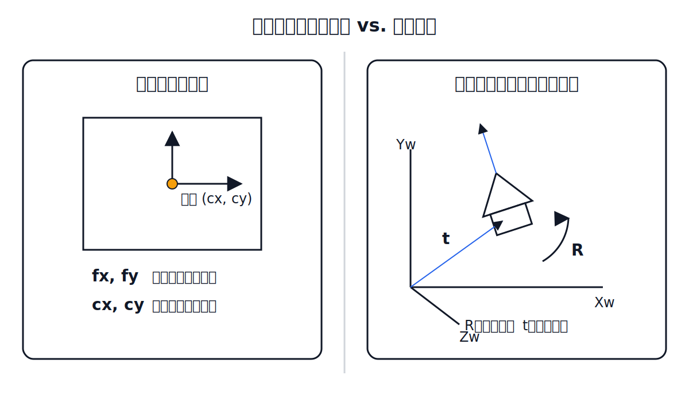

*图 3：内参描述相机自身的成像特性，外参描述相机相对于世界的位置和朝向。*

### 2.4 内参矩阵长什么样（可选）

```
K = [ fx   0   cx ]
    [  0  fy   cy ]
    [  0   0    1 ]
```

fx和fy是两个方向上以像素为单位的有效焦距。即使像素接近正方形，它们也可能因成像缩放等因素略有差别。cx和cy是主点坐标，通常接近照片中心。左下角的0和右下角的1是齐次坐标写法中的固定值。

为什么要用矩阵把参数装在一起？因为矩阵可以做链式乘法——把外参矩阵和内参矩阵乘在一起，得到一个总变换矩阵，一步完成从世界坐标到像素坐标的全部转换。

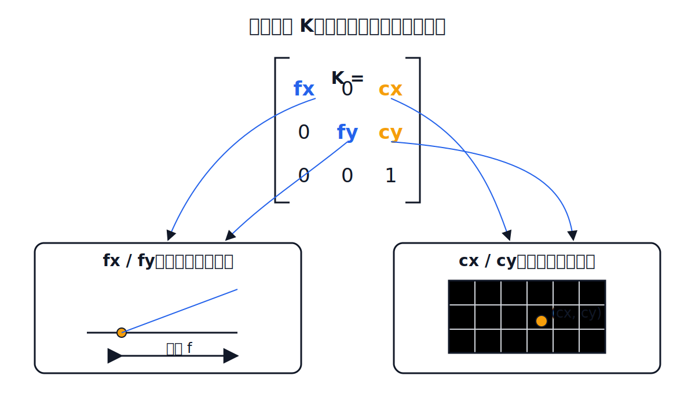

*图 4：fx、fy控制两个方向的缩放，cx、cy给出主点在像素坐标系中的位置。*

### 2.5 齐次坐标是个小技巧

在普通三维坐标(X, Y, Z)后面加一个额外的1，变成(X, Y, Z, 1)。多出来的这个1看起来很浪费，但带来了一个特别大的便利：平移操作也可以用乘法表示了。

这个写法的价值不在于乘法一定比加法快，而在于能用统一的矩阵形式表示旋转、缩放、平移和投影，并把连续变换合并起来。

可以这样想：把坐标加上第四个数字，就像给快递包裹贴统一面单。不管包裹经历多少道分拣，每个中转站都只看面单上的条码做一次乘法扫描。不贴这个面单，每次平移都要单独做加法，流程会变得七零八落。

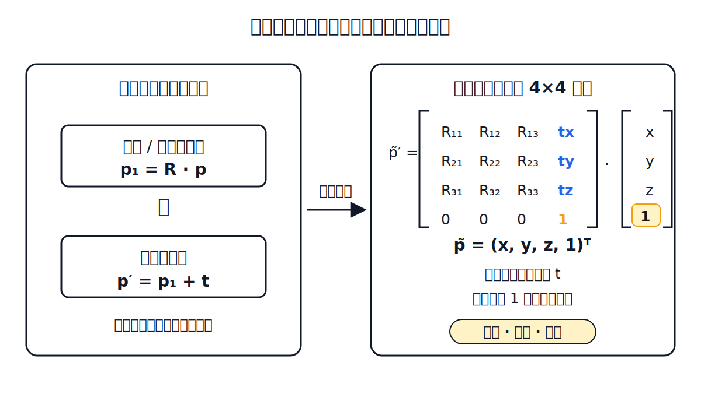

*图 5：补上第四个分量 1 后，旋转、缩放和平移可以写成一次矩阵乘法。*

### 2.6 旋转有三种表示法（选读）

旋转在数学上有三种描述方式：

- 欧拉角：用三个角度值，绕X轴转多少、绕Y轴转多少、绕Z轴转多少。直观——你说"抬头30度、左转45度"就行。但存在万向节死锁问题，在某些角度下会丢失一个自由度。想象飞机操纵杆拉到极限后，滚转和偏航变得没法区分。
- 罗德里格斯向量：一个三维向量，方向是旋转轴，长度是旋转角。OpenCV标定程序的外参旋转用的就是它。只需要3个数字，而旋转矩阵需要9个。
- 旋转矩阵：一个3×3的正交矩阵。占地方（9个数），但最适合做矩阵乘法。标定过程中这三种表示法经常互相转换。

---

## 第三部分：镜头为什么让图像变形？

### 3.1 哈哈镜效应

小孔成像是理想模型。没人用小孔相机拍照（进光量太小）。真实相机用透镜聚光，透镜不是完美的。

站在哈哈镜前，笔直的身材在镜子里变成细长条或矮胖墩。透镜对图像的扭曲虽然没那么夸张，本质是一样的——光线的路径被弯曲了，而且越靠近图像边缘，弯得越厉害。

### 3.2 两种最常见的变形

相机镜头的变形（畸变）主要有两种：

**桶形畸变**

图像像被吹鼓了，直线向外膨胀弯曲，像把照片贴在球面上。广角镜头和鱼眼镜头特别容易出这种效果。你就想象把一个平整的纸面按在篮球上——中心还比较平，边缘都翘起来了。

**枕形畸变**

跟桶形相反。直线向内凹陷，四角往外拉扯。长焦镜头更容易出现。想象你用拇指和食指捏住手帕中心往外拽，边缘会向内收缩。相反的力作用在图像四角，就是枕形的效果。

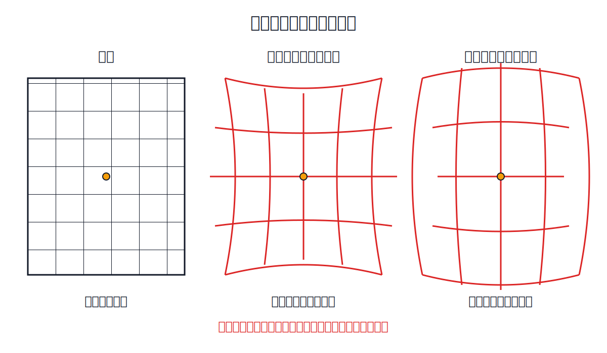

*图 6：桶形畸变使直线向外鼓起，枕形畸变使直线向内收缩。*

### 3.3 透镜为什么不完美

根本原因是：光线经过透镜时，不同位置的光线弯曲程度不一样。

放大镜的中心看东西基本正常，靠近边缘直线就开始弯了。真实相机镜头由多片透镜组合而成，设计者要在"聚好光"和"不变形"之间做艰难的平衡，没法两全。

还有切向畸变，常用来近似描述镜头组件与成像平面存在偏心或装调误差时产生的非径向偏移。它不同于简单的透视梯形变形。

畸变需要用选定的数学模型描述。OpenCV常见的五参数针孔模型使用k1、k2、k3描述径向畸变，p1、p2描述切向畸变；参数的排列顺序通常是(k1, k2, p1, p2, k3)。

- k1通常起主要作用，k2和k3补充高阶径向变化。这些系数的大小与坐标归一化方式和所用模型有关，不能只比较数值就判断镜头畸变强弱。鱼眼镜头通常应使用专门的鱼眼投影与畸变模型。
- p1、p2描述切向畸变。它们接近零只表示在当前模型和数据下切向项较小，不能单独据此判断镜头装调质量。

畸变较小的普通镜头有时用k1、k2、p1、p2就够了；是否加入k3或更高阶参数，应根据视场、数据覆盖和验证结果决定。参数越多并不一定越准，也可能过拟合。

更复杂的模型还可能包含薄棱镜畸变等项，用来拟合普通五参数模型没有覆盖的误差。绝大多数入门场景先不用考虑。

理解畸变模型最关键的一点：畸变参数的物理意义不重要，重要的是它们一起构成了一个"反扭曲配方"。有了这串数字，程序就能算出每个像素应该被搬到哪里去。

---

## 第四部分：怎么让照片变正常？

### 4.1 去畸变

知道照片被拍弯了，能不能把它掰回来？可以。这个过程叫去畸变。

常见实现采用反向映射：

1. 遍历输出图像中的每个像素
2. 计算它在原始畸变图像中对应的亚像素坐标
3. 从原图取邻近像素插值，得到输出像素

操作上，你拿着算出来的畸变模型（k1、k2那几个数字），一个一个把像素挪到它该待的位置。最后得到一张横平竖直的照片。

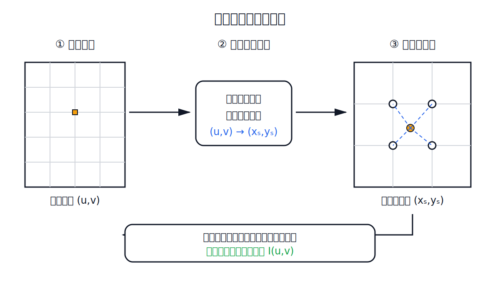

*图 7：输出像素反查输入图中的亚像素位置，再由周围四个像素插值得到颜色。*

### 4.2 鱼眼镜头的特殊之处

普通广角镜头的视场常在60到100度左右。鱼眼镜头的标称视场可接近180度，有些型号在某个方向上会略大于180度，因此可能拍到光轴后方的一小部分区域。

鱼眼镜头利用非透视投影把极广的视野放进有限的画面。多数不穿过投影中心的空间直线，在鱼眼图像中通常会弯曲；穿过投影中心的直线仍可能成像为直线。

普通镜头追求"照片和肉眼看到的差不多"。鱼眼镜头追求"把周围一切都拍进来"。就像站在巨大半球屏幕中心，一眼看到前方180度的所有东西，边缘部分自然是弯的。

### 4.3 五种投影模型

光线从3D世界射入镜头再到感光芯片，这个过程的数学描述叫投影模型。不同镜头用不同的投影规则：

| 投影模型     | 核心规则                      | 直观感受                                     |
| ------------ | ----------------------------- | -------------------------------------------- |
| 透视投影     | 像高 = 焦距 × tan(入射角)    | 和你眼睛看世界的方式一样，普通相机的标准模型 |
| 体视投影     | 像高 = 2×焦距×tan(入射角/2) | 保角性较好，边缘拉伸较明显                   |
| 等距投影     | 像高 = 焦距×入射角           | 入射角和像高严格正比，天文测量用这种         |
| 等立体角投影 | 像高 = 2×焦距×sin(入射角/2) | 相同立体角对应相同像面面积                   |
| 正交投影     | 像高 = 焦距×sin(入射角)      | 边缘压缩较强                                 |

五种模型是不同的角度到像高映射规则。同一个场景使用不同模型，边缘区域的拉伸或压缩程度会不同。

普通镜头通常从针孔透视模型开始。鱼眼镜头则要选与镜头设计和软件实现相符的模型；实际标定软件也常用"基础鱼眼投影加多项式修正"，不一定严格等于表中的某一种理想模型。

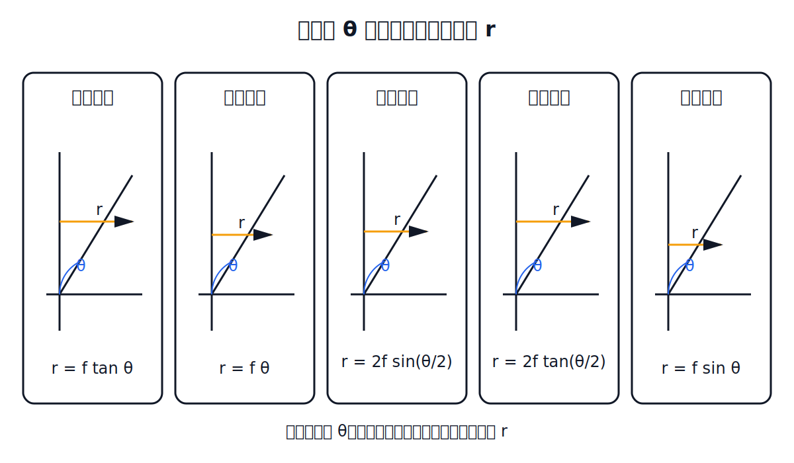

*图 8：不同模型用不同关系把入射角 θ 映射为图像半径 r。*

### 4.4 全向相机（扩展视野）

全向成像系统可以覆盖很大的视场，常见形式包括鱼眼镜头、反射镜与相机组合，以及多相机拼接。部分全向模型仍假设单一有效视点，部分系统则不满足这个假设。Scaramuzza等人提出过用多项式描述像素与空间射线关系的通用模型；OpenCV的`omnidir`模块实现的是另一类统一全向相机模型。入门阶段知道不同系统需要匹配相应模型即可。

---

## 第五部分：张正友标定法

### 5.1 这个人是谁

张正友，华人计算机科学家。1999年发了一篇论文，提出用平面棋盘格标定相机的方法。不需要昂贵设备，打印一张棋盘格贴硬板，拍几张照片，就能算出相机参数。现在全世界都在用，OpenCV和MATLAB用的都是他的变体方法。

### 5.2 为什么是棋盘格

理论上用什么图案都行。棋盘格胜出有三个理由：

1. 角点特别容易找。黑白交界处的十字交叉点，算法能精准定位到比一个像素还精确的程度。
2. 零成本。打印机打张A4纸，贴在硬纸板上就行了。
3. 几何简单。所有方格大小一样，所有角点在同一平面上，数学上好处理。

除此之外还有圆点网格，即白底上排列黑色圆点。在模糊或特殊成像场景中，圆点有时更容易稳定定位。非对称圆点网格通过错列排布消除部分方向歧义。多数普通场景从棋盘格开始即可。

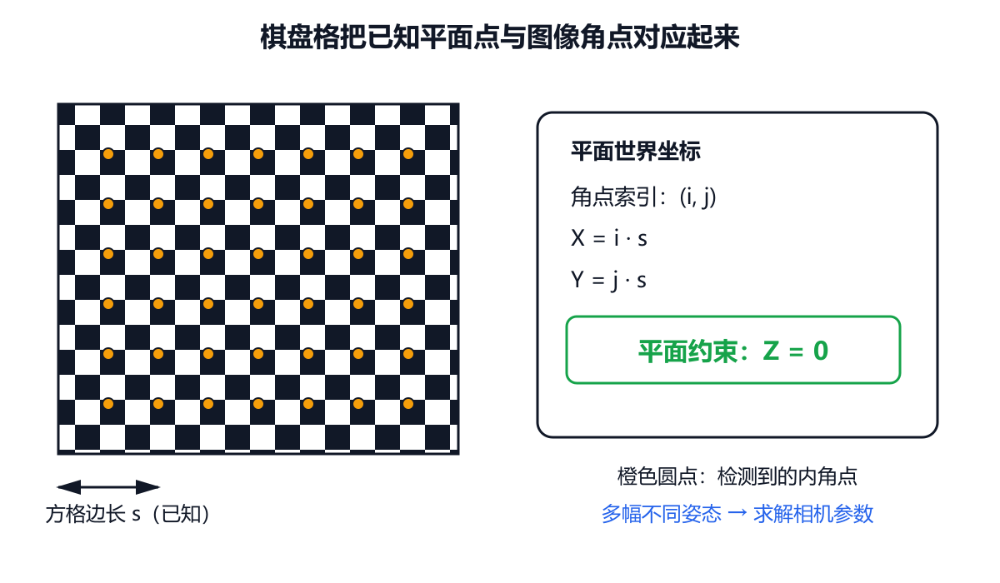

*图 9：规则内角点提供稳定的行列索引、已知方格尺寸和平面约束。*

### 5.3 核心思想

你有一块棋盘格。你不知道相机的焦距和畸变参数，但你知道棋盘格的真实尺寸，例如每个格子都是边长2.5厘米的正方形，并按规则排列。程序中常用"9×6内角点"描述检测尺寸，不是方格数量。

从不同角度、不同距离拍这个棋盘格：

- 第一张：正对棋盘格，距离1米，照片里看起来规整，接近正方
- 第二张：从左侧斜拍，照片里变成梯形，左小右大
- 第三张：靠近，稍微仰拍，变成倒梯形
- 第四张：旋转45度，俯拍，倾斜且发生透视变形

棋盘格的真实尺寸你知道，照片上角点的像素位置算法帮你找出来了。问题就变成了：什么样的相机参数和拍摄位姿，能让"真实棋盘格到照片棋盘格"这件事说得通？

从不同角度拍足够多张（实践中常拍15到20张），算法就能联合估计相机内参和每张照片的外参。姿态变化不足时，数学上可能存在退化或参数强耦合，结果并不一定唯一、可靠。

换个角度理解：张正友标定法本质上是解方程。每个未知数是相机参数（焦距、主点这些），每个"方程"来自一张照片中棋盘格角点提供的几何约束。一张棋盘格照片有足够多的角点，但所有角点都在同一个平面上，所以一张照片的约束不够独立——你需要从不同角度拍更多照片，给出独立的方程。

### 5.4 操作流程

**第一步：准备棋盘格**

- 打印棋盘格图案（常见示例使用9×6内角点，也就是10×7个方块；OpenCV并不限定这一尺寸）
- 精确测量每个方格的边长
- 贴在平整的板子上。板面翘曲会带来系统误差。

内角点是什么？棋盘格内部黑块和白块交界处的小十字。一张9×6内角点的棋盘格对应10×7个黑白方块，至于是10列7行还是10行7列，取决于程序对宽和高的约定。

**第二步：拍照（最重要的一步）**

- 固定相机（如果相机是固定的比如车载摄像头），移动棋盘格
- 覆盖画面各个角落，左上、右上、左下、右下、中间
- 包含不同角度和不同距离
- 棋盘格完整出现在画面中
- 一般15到20张

**第三步：电脑算**

照片导入标定程序，程序自动检测角点，根据角点和已知棋盘格尺寸算出所有参数。输出内参矩阵K、畸变系数和每张照片的外参。

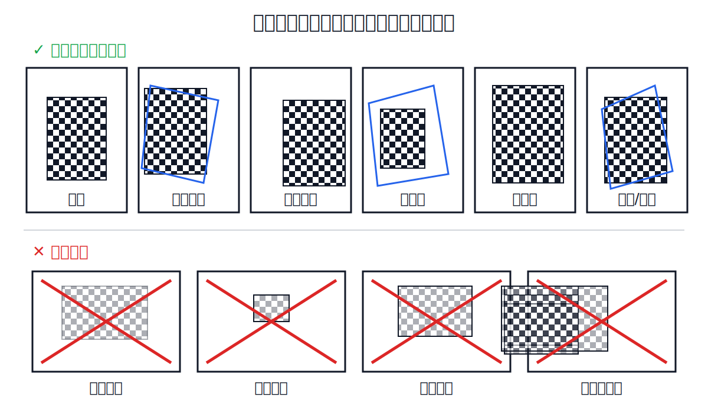

*图 10：照片应覆盖不同位置、距离和倾角，同时避开模糊、过小、重复和裁角。*

### 5.5 单应矩阵是什么

投影仪正对幕布时，矩形PPT投出来是矩形。投影仪从侧面斜射，画面会变成梯形。单应矩阵就是用来描述"一个平面上的点映到另一个平面上时发生了什么变化"的那张规则表。

在张正友标定中，棋盘格是平面，感光芯片也是平面。棋盘格平面到感光芯片平面的映射就是单应变换。每张照片对应一个单应矩阵H。H里面藏着相机参数的线索——通过多张不同角度的照片（每张有自己不同的H），算法能把H里的信息分离出来，反推出内参。

单应矩阵就像一个翻译官。一个平面说厘米方言，另一个平面说像素方言。H就是那本厘米-像素双语词典。

单应矩阵还有一个实用功能：图像校正和视角变换。你拍了张歪斜的文档照片——从侧面拍了桌上的合同，想把它摆正。找到文档照片上的四个角，用单应矩阵就能把歪斜的文档拉回矩形。OpenCV的`warpPerspective`函数就是干这个的。后面代码部分"虚拟广告牌"程序的核心也是它——用单应矩阵把logo贴到歪斜的广告牌表面。

---

## 第六部分：数学是怎么算出来的？

> 这章不要求你会算。理解思路就行。不需要会造发动机也能理解车怎么跑。

### 6.1 整体计算流程

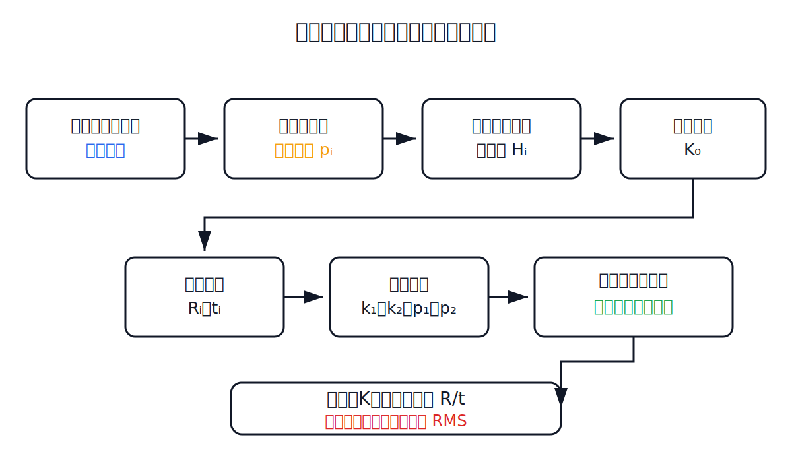

*图 11：前几步从单应矩阵得到参数初值，最后再联合减小所有图像的重投影误差。*

前五步给出初始估计，第六步再联合减小重投影误差。优化结果仍受数据质量、模型选择和初值影响。

第三步"从H里拆出内参K"用到了旋转矩阵的正交性，即旋转矩阵的每一列长度为1，两两互相垂直。在不额外固定内参的标准情形下，每个平面姿态提供两个约束，理论上至少需要三个非退化姿态；实际会使用更多照片来提高稳定性。

### 6.2 "优化"就像调收音机

前几步给出的参数是个初始估计，不算错但不够准。接下来要不断调整，让"理论算出来的照片"和"实际拍到的照片"之间差距越来越小。

就像调收音机旋钮：

- 隐隐约约听到一个电台，杂音很大（初始估计）
- 慢慢旋转调频旋钮，听声音变清晰了还是变模糊了（计算误差变化方向）
- 往清晰的方继续转一点（更新参数）
- 反复来，直到找到最清晰的频道（误差最小化）

数学上这个过程叫非线性最小二乘优化。名字吓人，本质上就是找一个最佳方案让所有不匹配都尽量小。

具体操作：把参数代回去，把棋盘格三维点重新投影到图像；再与检测到的角点对比。两者的像素距离叫重投影残差，优化通常最小化所有残差的平方和。

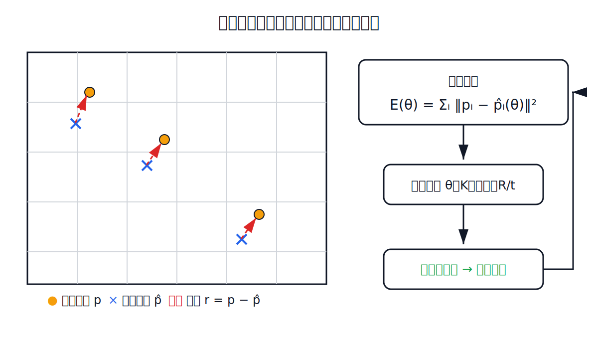

*图 12：观测角点与模型投影点之间的距离构成残差，优化不断减小残差平方和。*

### 6.3 LM算法：步子大了就收，小了就放

Levenberg-Marquardt算法是这类非线性最小二乘问题的常用方法。

你站在浓雾弥漫的山顶，目标是山谷最低点（误差最小的地方）。看不清远处的路，只能看到脚下一小块：

- 觉得某个方向往下倾斜，朝那个方向走一步
- 地面很陡，迈小步，别冲过头
- 地面很平缓，迈大步，加快进度
- 如果发现走反了（误差反而变大），退回来，换更小的步长重试

LM算法通过调节阻尼在两种策略之间过渡：阻尼较大时更接近梯度下降，阻尼较小时更接近高斯牛顿。一次尝试若没有降低误差，算法通常增大阻尼后重算；误差下降时则可减小阻尼。它提高了稳健性，但不能保证对任意初值都找到全局最优解。

有经验的司机在陌生路段减速慢行，上了高速就加油门。一个道理。

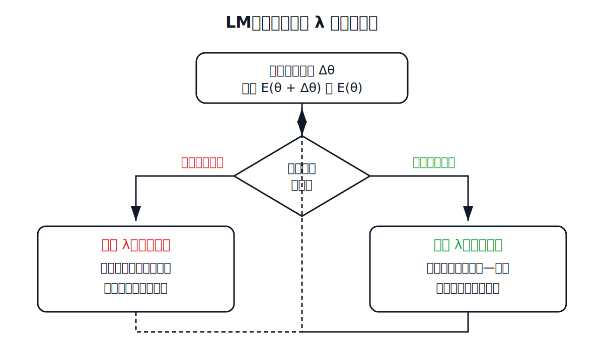

*图 13：试探成功时减小阻尼、加快靠近最优点；失败时增大阻尼、改用更谨慎的更新。*

### 6.4 还有哪些优化方法（选读）

- 梯度下降法：每次沿局部下降方向走一步。步长选择不当仍可能震荡或发散，步长过小又会收敛很慢。
- 牛顿法：把问题想象成二次曲面，一步推测最低点。收敛快，但要求初始值够好，否则可能跳到错误方向。
- 高斯牛顿法：专门针对误差平方和最小化问题的牛顿法变体。收敛同样快，同样对初始值敏感。

LM算法可看作梯度下降和高斯牛顿之间的阻尼过渡，通常比直接使用高斯牛顿更稳健。OpenCV的`calibrateCamera`使用基于LM思想的非线性优化来细化参数。

---

## 第七部分：双目相机

### 7.1 为什么需要两只眼睛

闭上一只眼睛去拿桌上的杯子。你会发现自己变笨了，手有时伸得太过，有时够不着。单只眼睛没法精确判断深度。

两只眼睛有深度感知，是因为视差。

竖起拇指放眼前30厘米。先用左眼看（闭上右眼），记住拇指相对背景的位置。再换右眼——拇指相对背景"跳"到了另一个位置。这个位置差就是视差。

物体越近，视差越大。物体越远，视差越小。远方山在两眼里几乎在同一个位置。大脑就用这个差异算深度。

### 7.2 如何从视差恢复深度

双目相机模拟人眼，两台相机水平并列，相隔一段距离（基线B）。

对已经完成立体校正、主点差异已妥善处理且视差沿水平方向计算的双目系统，常用公式是：

**深度 Z = (焦距 f × 基线 B) ÷ 视差 d**

- Z：物体到相机的距离（米），你最终要的答案
- f：水平方向焦距fx（像素）
- B：两台相机的距离（米），两个"眼睛"隔了多远
- d：视差（像素），同一个东西在左图和右图中位置差了几个像素

两台相机隔10厘米（B=0.1），焦距1000像素（f=1000），左图和右图中同一个物体差了5个像素（d=5）。深度Z = 1000×0.1÷5 = 20米。视差变成50个像素呢？Z = 1000×0.1÷50 = 2米。视差越大，物体越近。

实际系统还要处理匹配误差、遮挡和远距离小视差等问题。

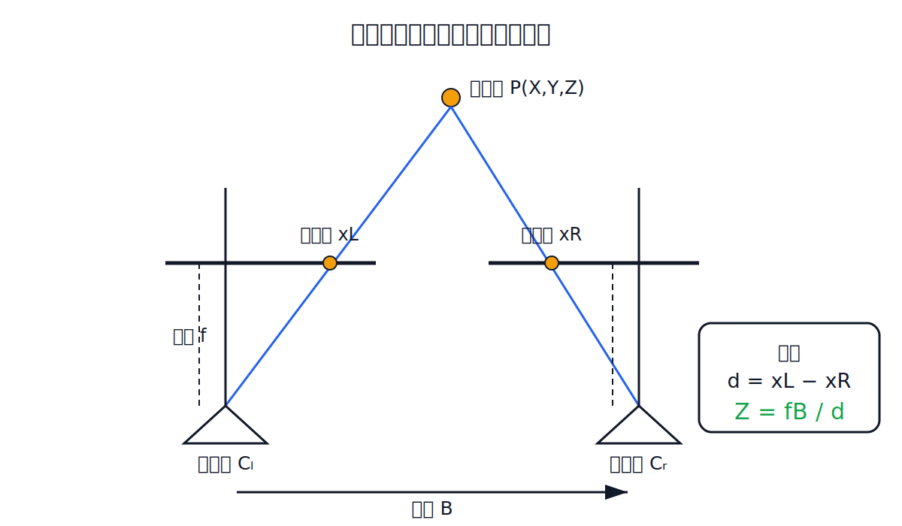

*图 14：同一空间点在左右图像中的横向位置差形成视差，并通过 Z=fB/d 换算深度。*

### 7.3 对极几何

对极几何的核心问题很朴素：左图中某个点，在右图里应该去哪条线找它的匹配点？

答案：不需要满图找。它一定在一条特定的线上，叫极线。

例如在左图看到一扇窗户，想在右图找到同一位置。对极几何把搜索范围从整幅图缩小到一条极线；只有经过立体校正后，这条极线才通常变成同一水平行。

三个相关的数学概念，知道它们各自的作用就够了：

| 名称       | 作用                                                                              |
| ---------- | --------------------------------------------------------------------------------- |
| 基础矩阵 F | 用像素坐标描述两个图之间的对极关系。左图第N行M列的点，右图里一定在F指定的那条线上 |
| 本征矩阵 E | F去掉相机内参后的纯几何版本，只包含两个相机之间的旋转和平移                       |
| 单应矩阵 H | 描述平面到平面的映射。看的物体是平面（比如墙壁）时，左图到右图可以直接整体变换    |

### 7.4 立体校正

现实中的双目相机很难做到两台完全平行，总会有装调误差。立体校正通过重映射，让对应的极线在两幅图中变成水平且相互对齐。

理想校正后，同一空间点在左右图中的Y坐标应一致；实际仍会有少量残差。匹配算法因此主要沿同一行搜索，计算量明显降低。

OpenCV常用的校正实现通常称为Bouguet方法。它计算两幅图的校正旋转与新投影矩阵，在极线对齐、共同视野和裁剪之间折中。

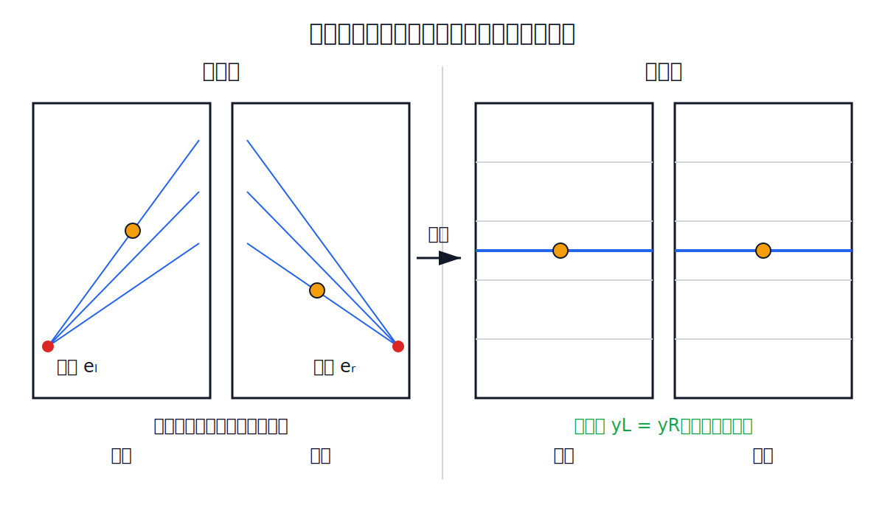

*图 15：校正前极线通过极点，校正后对应点落在同一条水平扫描线上。*

### 7.5 双目标定和单目标定的关系

双目标定建立在单目标定基础上：

1. 左右相机各自完成单目标定（各算各的内参和畸变）
2. 采集左右相机中对应同一标定板姿态的成对图像
3. 利用左右图中共有的角点，算两个相机之间的旋转R和平移T
4. 把两组内参、畸变和相机间的R、T一起做联合优化
5. 最后做立体校正，得到对齐的左右图

OpenCV里可由`stereoCalibrate`函数完成。每对左右图必须对应同一个标定板姿态，且角点顺序一致；如果相机或标定板在运动，还需要尽量同步曝光，否则两幅图中的板姿态会不同。

---

## 第八部分：实战经验

### 8.1 拍摄标定照片的黄金法则

都是前人踩过的坑：

1. 棋盘格必须平整。玻璃板或亚克力板最好。纸板受潮会翘，精度大打折扣。
2. 让棋盘格出现在画面各区域，尤其要覆盖四角附近。每张照片仍应包含算法所需的完整角点阵列。
3. 角度要多样。正面、左斜、右斜、上仰、下俯、旋转，每个都要有。
4. 距离要变化。近拍、中距、远拍各几张。
5. 棋盘格占画面30%到60%。太小了角点检测不准，太大了覆盖面不够。
6. 光线均匀。别强光直射棋盘格造成过曝或反光。
7. 别拍糊。快门不够就上三脚架。模糊照片角点检测误差极大。
8. 常以15到20张作为起点。少量但姿态丰富、质量高的照片可能胜过大量重复照片，不能只按张数判断精度。
9. 每个位置只拍一张。同一个位置连拍多张，数学上是冗余的，不加分。
10. 拍完跑一遍角点检测。确认每张角点都找对了。标定之后再补拍很麻烦。

### 8.2 怎么判断标定结果好坏

**第一指标：重投影误差**

程序会告诉你平均重投影误差，单位是像素。它表示"用算出来的参数预测的角点位置"和"实际角点位置"的差距。

- 小于0.3像素：通常较好
- 0.3到0.5像素：许多普通任务可以接受
- 0.5到1.0像素：建议检查角点、模型和拍摄姿态
- 大于1.0像素：通常需要排查数据或模型

但一条警告：重投影误差小不等于标定一定正确。所有照片从同一个位置拍的，误差可能很小，结果却是错的——因为缺少足够的约束信息。

**第二指标：交叉验证**

可以把照片分成训练组和验证组：用训练组标定，再检查验证组上的投影误差；也可用不同子集重复标定，观察参数稳定性。子集姿态分布应尽量相近，否则差异未必只由照片数量造成。

**第三指标：用眼睛看**

用标定参数对照片去畸变，观察：原来弯的直线变直了吗？四个角有没有异常拉伸或黑边？去畸变后图像自然、直线笔直，就是个好标志。

### 8.3 常见问题和解决方法

| 问题                   | 可能原因                   | 解决方法                                   |
| ---------------------- | -------------------------- | ------------------------------------------ |
| 重投影误差很大（>1px） | 棋盘格不平整或角点检测有误 | 换亚克力板；检查角点检测，手动剔除错误照片 |
| 标定结果每次不一样     | 拍摄角度不够多，约束不足   | 增加不同角度照片，特别是包含画面四个角的   |
| 畸变系数不稳定         | 棋盘格没覆盖到图像边缘     | 确保有照片拍到四角区域                     |
| 去畸变后四周有黑边     | 正常的——边缘像素被搬走了 | 用alpha参数裁剪或保留黑边                  |
| 焦距和实际不符         | 棋盘格尺寸输入错误         | 重新测量方格大小                           |

### 8.4 影响精度的六大因素

1. 棋盘格精度。打印精度和板材平整度是第一大误差源。自己用A4纸打印的远不如专业亚克力标定板。方格尺寸测量误差会直接传递到结果。
2. 图像数量。照片太少或姿态重复会使约束不足；增加高质量、姿态丰富的照片通常有帮助，但低质量或重复数据不会因为数量多就自动提高精度。
3. 姿态多样性。所有照片从差不多角度和距离拍的？标定算法没有足够信息分离不同参数。这是最常见的错误——拍了20张，全是从正前方2米处水平拍的。
4. 光照。过曝、欠曝、反光都影响角点检测精度。棋盘格白色区域高光溢出，角点检测位置会偏差很大。
5. 图像噪声。ISO太高、传感器热噪声大、压缩损伤严重，角点坐标引入随机噪声。
6. 模型选择。用普通相机模型标定鱼眼镜头，或者反过来，结果自然不对。

### 8.5 快速标定的思路

有些场景你不需要极高精度，够用就行。一些简化策略：

- 假设skew=0：像素是完美矩形，没有倾斜。绝大多数数码相机成立。
- 假设主点在图像中心：非专业测量任务，主点和理论中心的偏差不大。
- 只用低阶畸变参数：畸变较小且装调良好的普通镜头可以先尝试k1、k2，并通过验证判断是否加入k3和切向项。`CALIB_FIX_K3`只固定k3；若要令切向畸变为0，还需`CALIB_ZERO_TANGENT_DIST`。
- 减少照片：镜头畸变不大的话，10张精心挑选的照片也能有不错的结果。

这些简化在OpenCV中通过标定标志位实现：`CALIB_FIX_ASPECT_RATIO`固定像素比例，`CALIB_ZERO_TANGENT_DIST`切向畸变设为0，`CALIB_FIX_PRINCIPAL_POINT`固定主点位置。

---

## 第九部分：代码速览

> 不需要会编程。只看注释和步骤说明就行。

### 9.1 单目标定：calibration.cpp

```
第一步：读取参数
  - 棋盘格内角点数(w, h)，如实测9×6
  - 每个方格物理尺寸，如0.025（2.5厘米）
  - 需要用的照片数量
  - 输出文件名

第二步：循环处理每张照片
  for 每张照片:
      读照片
      转灰度图（角点检测在灰度图上更快更准）
      findChessboardCorners() 找棋盘格角点           ← 核心函数
      如果找到了 → cornerSubPix() 提升到亚像素精度     ← 精度关键
      把找到的角点坐标存到 imagePoints 列表
      在照片上画出角点（方便目视检查）

第三步：构建3D坐标
  - 棋盘格是平面(Z=0)，3D坐标就是：
    (0,0,0), (2.5cm,0,0), (5cm,0,0), ... 逐行排列

第四步：调用标定函数
  calibrateCamera(
    3D坐标列表,          // 真实棋盘格坐标
    2D角点列表,          // 照片上的角点坐标
    图像尺寸,
    输出→内参矩阵K,
    输出→畸变系数,       // k1,k2,k3,p1,p2
    输出→每张图的旋转R,
    输出→每张图的平移t
  )

第五步：评估质量
  - 用标定参数把3D点重新投影到2D
  - 跟实际角点对比，算重投影误差
  - 结合总体与单图重投影误差、参数稳定性和去畸变效果判断

第六步：保存结果
  - 内参K、畸变系数、外参保存为YAML文件

第七步（可选）：显示去畸变图像
  - initUndistortRectifyMap() 创建映射表
  - remap() 应用映射，显示结果
```

### 9.2 虚拟广告牌：virtual-billboard.cpp

```
功能：把场景中广告牌替换为指定logo

第一步：准备logo图
  - 读logo图
  - 定义四个角的坐标：左上(0,0)、右上(w,0)、右下(w,h)、左下(0,h)

第二步：准备场景图
  - 读场景照片
  - 让用户用鼠标依次点击广告牌的四个角
  - 记录四个角的像素坐标

第三步：算单应矩阵
  getPerspectiveTransform(源四个角, 目标四个角)
  → 输出3×3的单应矩阵H
  → H就是"把logo平面映射到广告牌所在平面"的规则表
  → 若有四对以上对应点或需要剔除误匹配，可用findHomography()配合RANSAC

第四步：应用变换
  warpPerspective(logo图, 场景图, H, 场景图尺寸)
  → 按H的规则把logo贴到广告牌位置
  → 广告牌是斜的，logo自动跟着变斜

第五步：合成
  - 把场景中广告牌区域涂黑
  - 把变形后的logo叠加上去
  → 广告牌区域被替换成变形后的logo
```

### 9.3 双目标定：stereo_calib.cpp

```
第一步：读取左右图列表
  - 按"左1、右1、左2、右2..."排列
  - 程序自动把奇偶位置分给左右相机

第二步：检测每对图像的角点
  for 每一对左右图:
      对左右图分别调 findChessboardCorners()
      多尺度尝试 → 确保不同分辨率都能检测
      成功→cornerSubPix() 提升到亚像素精度
      左右图都成功→保存这对角点数据
      否则跳过

第三步：单目标定初始化
  - 分别对左右相机角点数据调 initCameraMatrix2D()
  - 给出每个相机内参的初始估计

第四步：双目标定
  stereoCalibrate(
    3D坐标列表,
    左图角点列表,
    右图角点列表,
    左相机内参K, 左相机畸变,  // 输入初始 + 输出优化值
    右相机内参K, 右相机畸变,
    图像尺寸,
    输出→旋转矩阵R,          // 右相对于左的旋转
    输出→平移向量T,          // 右相对于左的平移
    输出→本征矩阵E,
    输出→基础矩阵F
  )

第五步：质量检查
  - 用基础矩阵F和对极几何算极线误差
  - 误差越小，双目匹配质量越高

第六步：立体校正
  stereoRectify(...) → 输出 R1, R2, P1, P2, Q
  - R1, R2：左右图的校正旋转矩阵
  - P1, P2：校正后投影矩阵
  - Q：视差转深度的矩阵（一步把视差图变成深度图）

第七步：显示校正结果
  - initUndistortRectifyMap() 生成映射表
  - remap() 得到行对齐的左右图
  - 在校正图上画绿线验证对齐
```

---

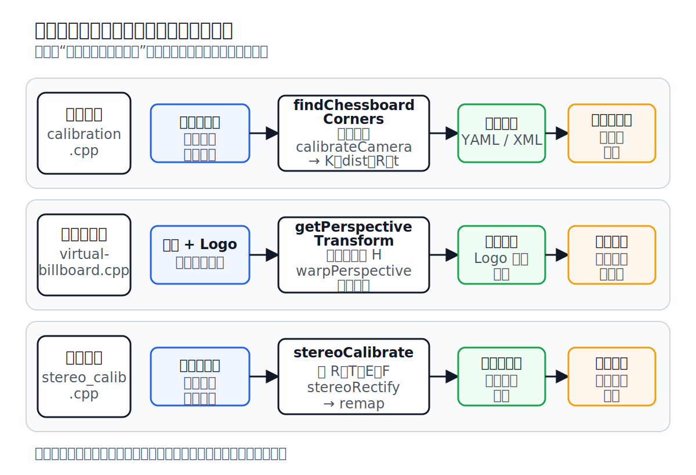

*图 16：单目标定、虚拟广告牌和双目标定各自使用不同的 OpenCV 核心操作与诊断量。*

## 第十部分：标定之后——硬件如何实时矫正图像

前面九部分讲了怎么标定相机，算出内参和畸变系数。标定完之后呢？这些参数怎么被用起来？

软件方案你已经见过了。OpenCV 的 `initUndistortRectifyMap()` 生成一张映射表，然后 `remap()` 用这张表逐像素把畸变图像"掰正"。CPU可以完成这项工作，但高分辨率、高帧率场景可能占用较多算力和内存带宽。

一张 4K（3840×2160）图像约有830万像素。双线性重映射通常要查询坐标，再读取输入图中邻近的2×2像素并写回。具体耗时取决于CPU、内存、数据格式和实现优化，不能一概而论；在功耗或延迟受限的设备上，常会使用GPU、DSP或专用硬件。

因此，一些系统会用专门的硬件加速器完成重映射。下面以一个AGDC（Advanced Geometric Distortion Correction）硬件IP版本为例。以下流水级、缓存行数、数据位宽、接口和格式等具体常数均以目标AGDC spec为准；本文所述版本在满足时钟、带宽和配置条件时，目标吞吐率为4K@30fps。

### 10.1 核心思想：把 remap 变成硬件流水线

回忆一下标定课第五章讲的代码：

```
initUndistortRectifyMap(K, dist, ...)  →  生成 map_x, map_y (两张映射表)
remap(src, dst, map_x, map_y, INTER_LINEAR)  →  用双线性插值生成矫正图
```

AGDC 做的就是同一件事，不过它把整个过程变成了一个硬件流水线。关键区别在于：它不需要存整张 map_x/map_y 表（一张 4K 图像的两张 float 映射表要几十兆字节），而是存一张**稀疏网格（Mesh LUT）**——比如 32×16 个节点。矫正时实时从稀疏网格插值出每个像素的映射坐标。

这样做会引入网格近似误差，但可把映射存储量从几十MB降到几KB。32×16个节点按常规边界定义形成31×15个网格单元；这一密度是否够用取决于畸变强度、输出分辨率和允许误差，需要用完整映射或测试图验证。

### 10.2 数据流：像素是怎么被矫正的

知道了要做什么，来看硬件怎么一步步做。整个过程从左上角像素开始，逐行向右扫描，碰到帧尾再从左侧开始下一行。每扫到一个输出像素 (x, y)，就执行以下流水线：

```
S0: 坐标生成    ── 输出像素(x,y) → 算出它在Mesh网格中落在哪四个节点之间 → ix, iy, alpha, beta
S1: Mesh查表    ── 读出四个相邻节点的(u,v)坐标
S2: 坐标插值    ── 用alpha/beta对四个节点的uv做双线性插值 → 得到输入图像上的亚像素坐标(u,v)
S3: 源地址+行缓冲 ── 生成源地址，并从片上SRAM读取(u,v)周围的2×2像素块
S4: 像素插值    ── 对2×2像素做双线性插值，Y/U/V三通道并行 → 得到最终矫正像素
```

你不需要理解每一级的细节。S0到S2负责算出输出像素对应输入图像上的哪个位置，相当于生成或查询map_x/map_y；S3到S4负责读取邻域并插值，对应`remap()`的主要像素处理。

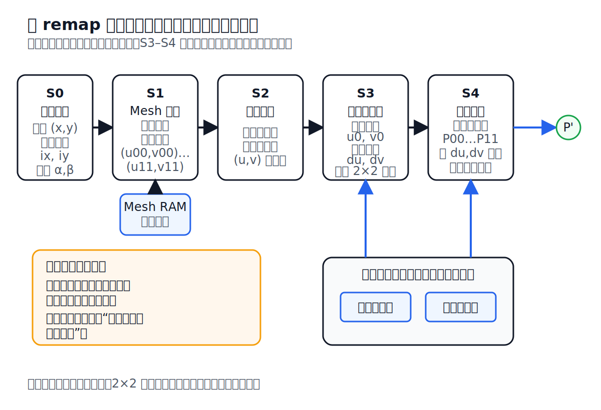

*图 17：坐标流依次完成查表和插值，像素流在片上行缓冲中组成邻域并输出矫正像素。*

### 10.3 S3-S4 的精妙之处：行缓冲

这五级流水线中，S3负责源地址生成和行缓冲读取。

矫正的一个麻烦在于：输出像素按顺序扫描时，对应的输入坐标(u, v)不一定落在同一行，也不一定严格单调。正常的连续畸变映射下，相邻输出像素通常仍映到相邻输入区域，但垂直偏移会随位置变化。

这就带来一个问题：你需要缓存多少行输入才能保证任何时候都能取到 (u,v) 周围的 2×2 像素？

AGDC 的方案是用片上SRAM维护一个**滑动窗口**，缓存映射当前输出区域所需的若干输入行。这里描述的架构缓存68行；随着处理推进，旧行会被新行覆盖。

所需行数由一个处理区间内输入坐标v的最大跨度、插值需要的相邻行以及预取余量共同决定，不能只由32×16个节点或31×15个网格单元推出。68行是否足够，必须对目标映射范围做边界检查。离线slice模式可把输出图按X方向切成竖条；如果SRAM按slice宽度重新组织，较窄的条带可以换取更深的行缓存，但具体增益取决于目标spec中的存储布局。

行缓冲内部用了**奇偶 BANK** 的结构。偶数行存在一个 BANK，奇数行存在另一个 BANK。因为 2×2 块需要连续两行（N 和 N+1 行），而这两行一定奇偶相反（一个是偶数行、一个是奇数行）——所以能在同一个时钟周期内从两个 BANK 同时读取。这就是硬件设计的精妙之处：结构安排让物理限制变成了天然优势。

### 10.4 两种工作模式

AGDC 支持两种场景，共用同一套流水线和同一块 SRAM：

**离线模式（从 DRAM 读）：**

输入图像已经存在 DRAM 里。AGDC 通过 DMA 主动从 DRAM 逐行取数据，写入行缓冲。然后流水线从行缓冲读像素做矫正。DMA 会根据需要在 SCAN 开始前预先取够安全水位的行数（PREFILL 阶段），确保流水线不会断流。

软件还可以把一帧切成多个竖向 slice 分多次处理——每个 slice 只需要缓存对应输入列的窗口，同样的 SRAM 面积能换取更大的有效行深，覆盖畸变更大的场景。

**在线模式（ISP 直通）：**

传感器数据流（ISP 输出）直接实时灌入行缓冲，不经过 DRAM。行缓冲内有一个异步 FIFO 做 ISP 时钟域到 Core 时钟域的转换。这种模式延迟极低，适合需要实时输出矫正画面的场景。

两种模式可共用主要计算流水线，但仍需要正确配置数据源、时钟域、缓存水位和地址等控制项。

### 10.5 从标定参数到硬件配置：完整的桥接

这可能是最关键的一节——标定出的数字怎么实际灌进硬件？

标定课程的产出是一组参数：内参矩阵 K（含焦距 fx、fy、主点 cx、cy）和畸变系数（k1、k2、k3、p1、p2）。这些是数学描述。

AGDC 需要的是另一组数据：Mesh 查找表，也就是每个网格节点上存的 (u, v) 坐标对。u 是输入图像上的水平亚像素坐标，v 是垂直亚像素坐标。

从标定参数到 Mesh 表的过程，由**软件/驱动**完成：

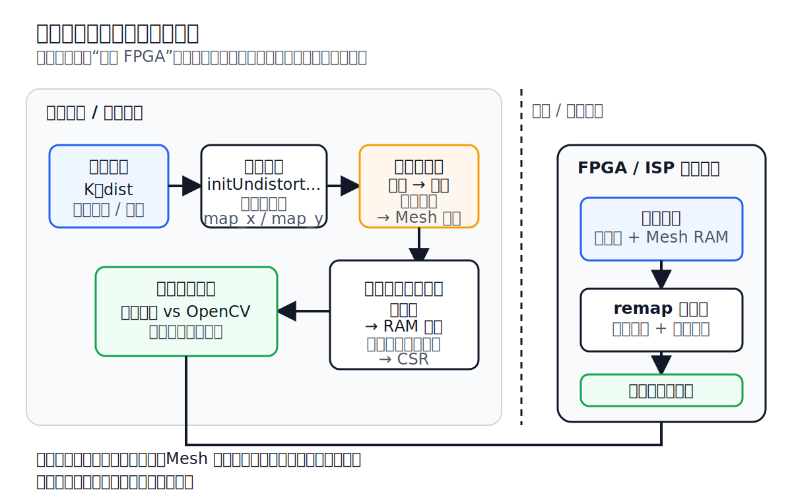

*图 18：主机把浮点标定结果转换、量化并验证，再写入硬件寄存器与 Mesh RAM。*

这个转换过程的核心逻辑是：对于每个Mesh节点位置（均匀分布在输出矫正画布上），用标定参数反算出它在输入畸变图像上对应的坐标(u, v)。这个过程与`initUndistortRectifyMap`生成反向映射的思路一致。本文示例只保存32×16个节点，它们按常规定义覆盖31×15个网格单元；OpenCV的完整映射则为每个输出像素保存坐标。

AGDC 的寄存器规格中包含了：输入输出帧尺寸、Mesh 网格行列数、输入格式（YUYV/NV12/YUV422I 等）、输出格式、DRAM 源/目标地址、行跨度、ROI 窗口、离线 slice 配置等。一次标定完成后，这些参数中不变的部分（如 Mesh 表）只需配置一次，变的部分（如 DRAM 地址）每帧更新。

### 10.6 为什么这跟标定精度密切相关

标定课第八章讲了影响精度的六大因素。从 AGDC 的角度来看，又多了一个维度：

**Mesh网格密度会限制矫正精度。** 32×16个节点按常规定义形成31×15个网格单元。单元内部的(u,v)坐标由四个节点插值得到。网格越密，通常越能逼近完整映射，但Mesh表占用的存储也越大。

这揭示了一个工程折衷：标定的数学精度可以很高（重投影误差小于 0.1 像素），但如果下游硬件用的 Mesh 网格太稀疏，实际矫正精度会被网格插值误差主导。

反过来，如果标定本身精度很差（比如用了不平整的纸板棋盘格），Mesh 表里的 (u,v) 值本身就偏了，AGDC 硬件做得再好，矫正出来也是歪的。垃圾进，垃圾出。

整个系统的误差由标定误差、Mesh近似误差、定点量化和像素插值等因素共同造成，不能简单写成其中某一项的最小值。应分别测量这些误差，并在最终输出图上验证。

---

## 术语速查表

按文档中出现顺序排列，一句话解释。

| 术语           | 一句话解释                                                                                               |
| -------------- | -------------------------------------------------------------------------------------------------------- |
| 相机标定       | 算出相机的视力参数（焦距、畸变）和站位信息（位置、朝向）                                                 |
| 内参           | 相机自己固定的光学属性：焦距、主点、像素尺寸比                                                           |
| 外参           | 相机在哪儿、朝向何方。你移动一次它就变一次                                                               |
| 小孔成像       | 光线穿过针孔在暗箱后方形成倒立影像，所有相机的基础模型                                                   |
| 坐标系         | 原点和三根坐标轴组成的网格，用来描述物体定位                                                             |
| 世界坐标系     | 描述真实世界中物体位置的参考框架，原点可以选房间角落                                                     |
| 相机坐标系     | 以相机自身为中心重新定义的三维坐标系                                                                     |
| 图像坐标系     | 感光芯片上的二维坐标系，单位毫米                                                                         |
| 像素坐标系     | 数字照片上的二维坐标系，单位像素，原点在左上角                                                           |
| 焦距           | 镜头中心到感光芯片的距离，决定放大倍率。越长，远处越大                                                   |
| 主点           | 光轴与成像平面的交点在照片上的像素坐标，通常接近照片中心                                                 |
| 矩阵           | 一张整齐的变换规则表，输入坐标算出输出坐标                                                               |
| 齐次坐标       | 在普通坐标后面加一个1，让平移也能用乘法做                                                                |
| 畸变           | 实际成像偏离所选理想投影模型的系统性几何偏差                                                             |
| 径向畸变       | 从中心向外的辐射状弯曲，分桶形（外鼓）和枕形（内凹）                                                     |
| 切向畸变       | 常用于拟合偏心或装调误差造成的非径向偏移                                                                 |
| 去畸变         | 根据畸变参数把弯曲照片掰回正常的操作                                                                     |
| 鱼眼镜头       | 180度超广角视野，边缘弯曲是设计特性不是缺陷                                                              |
| 投影模型       | 3D光线到2D芯片的映射规则，不同镜头用不同规则                                                             |
| 张正友标定法   | 打印棋盘格拍多张照片来标定，1999年提出，至今最常用                                                       |
| 角点           | 棋盘格黑白方块交界处的十字交叉点，标定的锚点                                                             |
| 单应矩阵       | 平面到平面的透视变换规则表                                                                               |
| 重投影误差     | 用标定参数反算的角点和实际角点的差距，衡量精度的核心指标                                                 |
| 优化           | 调收音机旋钮一样不断调参数，让理论预测和实际差距最小                                                     |
| LM算法         | 自动调步长的优化算法，参数波动大就收步子，接近目标就放步子                                               |
| 梯度下降       | 沿着下山方向一步步走的优化策略，安全但慢                                                                 |
| 高斯牛顿法     | 比梯度下降更快但需要初始值够好                                                                           |
| 双目相机       | 两台水平排列的相机，模仿人眼获取深度                                                                     |
| 视差           | 校正后的左右图中，同一空间点的水平坐标差；其他条件相同时越大越近                                         |
| 基线           | 双目相机两个光心之间的距离；增大基线可改善远距离深度分辨率，但会减小共同视野、增大近距离遮挡和匹配难度   |
| 对极几何       | 左图上的点在右图上一定落在某条特定的线上                                                                 |
| 基础矩阵F      | 用像素坐标描述左右图对极关系的3×3矩阵                                                                   |
| 本征矩阵E      | 去掉内参后的纯几何版本，只包含两个相机之间的旋转和平移                                                   |
| 立体校正       | 重映射左右图，使对应极线水平并相互对齐                                                                   |
| Bouguet校正    | OpenCV常用的立体校正方法，在极线对齐、共同视野和裁剪之间折中                                             |
| 亚像素         | 比一个像素更小的精度，通过周围像素亮度梯度推断精确位置                                                   |
| 欧拉角         | 三个角度表示三维旋转，直观但有万向节死锁                                                                 |
| 罗德里格斯向量 | 一个三维向量同时表示旋转轴和角度，OpenCV标定用这种                                                       |
| DLT算法        | 直接线性变换，快速但精度不高的标定方法，常用来算初始值                                                   |
| 全向相机       | 拍360度全景的相机，标定比普通相机复杂                                                                    |
| AGDC           | Advanced Geometric Distortion Correction，一个硬件IP模块，用Mesh LUT加双线性插值在硅片上实时矫正畸变图像 |
| Mesh LUT       | 稀疏网格查找表，例如32×16个节点形成31×15个单元，每个节点存输入图像上的亚像素(u,v)坐标                  |
| 流水线         | 把大任务拆成多个小步骤，每一级同时处理不同数据，像工厂流水线                                             |
| 亚像素坐标     | 非整数像素坐标如(123.45, 67.89)，双线性插值根据小数部分算最终颜色                                        |
| 行缓冲         | 片上SRAM维护的滑动窗口，缓存最近若干行输入像素供插值引擎使用                                             |
| 奇偶BANK       | 偶数行和奇数行分存不同SRAM BANK，利用行号奇偶相反特性实现同时读取                                        |
| DMA            | 直接存储器访问，硬件不经过CPU直接从DRAM读或向DRAM写数据                                                  |
| 离线模式       | 输入图像已在DRAM中，AGDC通过DMA主动逐行读取                                                              |
| 在线模式       | 传感器输出通过ISP直接灌入AGDC，不等DRAM写完就处理，延迟更低                                              |
| Slice          | 把输出图按X方向切成多个竖条分次处理，用同样SRAM覆盖更大畸变范围                                          |
| ROI            | Region of Interest，输出矫正画面的裁剪区域，只处理ROI内像素                                              |

---

## 写在最后

读到这儿，你应该形成了一个完整的知识框架。你知道了：

- 相机成像原理和为什么要标定
- 三维世界怎么变成二维照片
- 镜头为什么不完美
- 怎么用棋盘格标定相机
- 数学计算的大概思路
- 双目系统怎么获得深度
- 实际操作的注意事项
- 代码在干什么
- 标定参数怎么喂进硬件实现实时矫正

几个提醒：

相机参数在重新对焦、变焦、拆装、碰撞或明显温度变化后可能改变。是否定期重标应根据机构稳定性、环境变化和精度验证结果决定；稳定的固定焦相机不必无条件按固定周期重标。

标定精度是相对的。手机AR用的精度和工业测量（微米级）用的精度，是两回事。匹配你场景的精度要求就行。

理解不等于掌握。读完这篇文章，你只是"理解了标定"。真正的掌握来自亲手操作：用OpenCV跑一遍标定流程，用MATLAB标定工具箱玩一遍，在真实场景中拍一组棋盘格照片看结果。这是任何文字都无法替代的。

下一步可以：

- 用OpenCV或MATLAB实际跑一遍完整标定流程
- 了解全向相机（全景相机）的标定方法
- 学习多相机系统的联合标定（自动驾驶车上往往有十几个摄像头）
- 如果有硬件背景，了解畸变矫正加速器的设计（AGDC 的 spec 和 RTL 就是现成的参考）
- 如果对数理感兴趣，深入标定的数学推导

相机标定让机器知道成像几何关系。对于涉及几何测量、三维重建或定位的视觉系统，它通常是一项基础工作。
